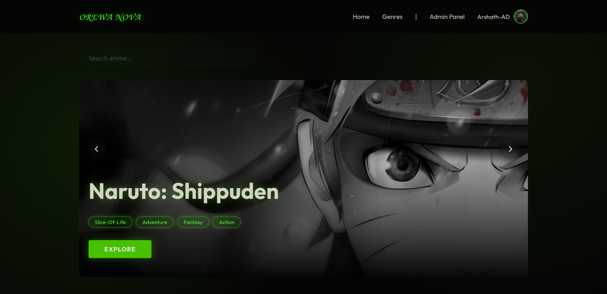
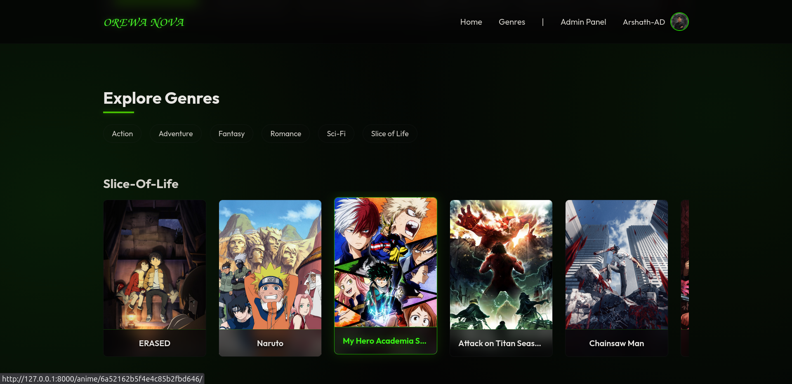
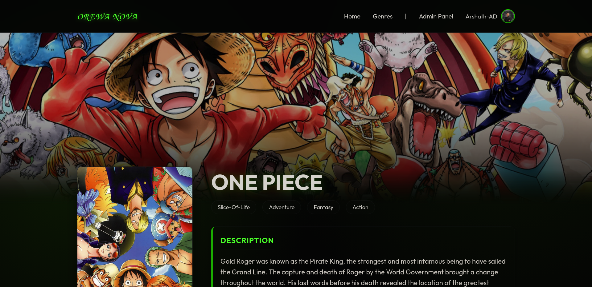
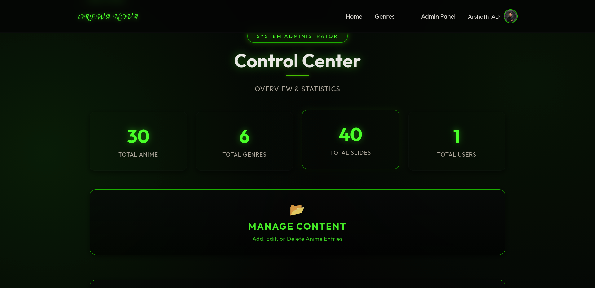
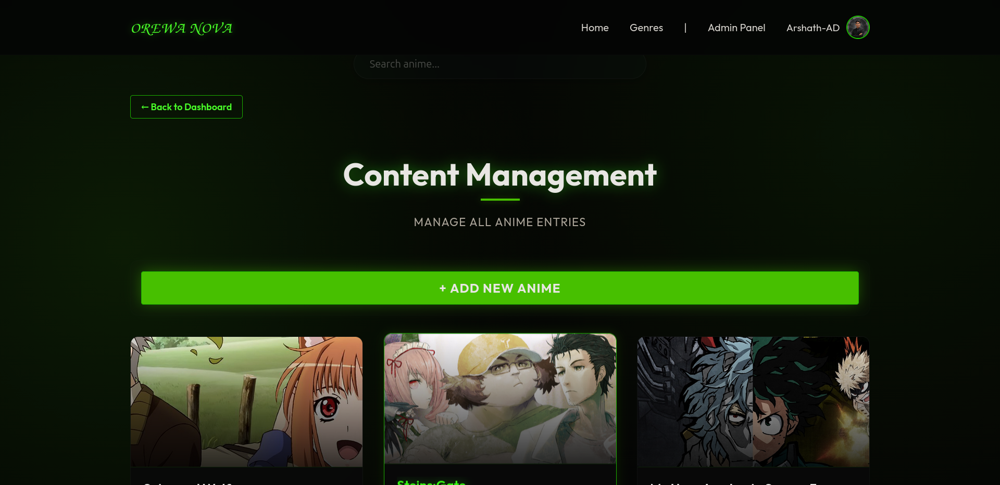

# Orewa Nova – Anime Review Web App

A full-stack anime discovery and review platform built with Django, MongoDB, and Docker.

## 📌 Overview

Orewa Nova is a modern anime exploration platform where users can:
- Browse anime by genre
- View detailed anime pages with dynamic slide galleries
- Manage user profiles and avatars
- Administer content through a custom admin dashboard

The project utilizes a hybrid database approach: Django (SQLite) handles authentication and user profiles, while MongoDB manages the massive content data (anime details, reviews, genres).

## 📸 Preview

<!-- Replace the links below with your actual screenshot paths -->






## 🧱 Tech Stack
| Layer | Technology |
| --- | --- |
| **Backend** | Django 5 / Python 3.12 |
| **Database** | MongoDB (Content) + SQLite (Auth) |
| **Infrastructure**| Docker & Docker Compose |
| **Frontend** | HTML5, CSS3, JavaScript |
| **UI Library** | Glide.js |
| **Media** | Django File Storage |

## ✨ Features
### 🎨 UI & Experience
- Dark modern theme with responsive card grids
- Hero image section on anime detail page
- Portrait & landscape thumbnails
- Animated hover effects
- Glide.js image gallery slider
- Genre-based browsing

### 👤 Authentication & Profiles
- User Signup/Login
- Profile Page with Picture Uploads
- Default Avatar System
- Staff-based Admin Access

### 🛠 Admin & Data Management
- Custom Admin Dashboard to Add/Edit/Delete Anime
- Robust, Idempotent MongoDB Database Seeding Pipeline
- Automated media download and organization (Landscapes, Portraits, Slides)

## 📁 Project Structure

```bash
orewa_nova/
├── Dockerfile                  # Container definition
├── docker-compose.yml          # Multi-container orchestration (Web & Mongo)
├── entrypoint.sh               # Docker startup script
├── db.sqlite3
├── manage.py
├── media/                      # Auto-populated by the seed script
│   ├── anime/
│   │   ├── slidesimg/
│   │   └── thumbnails/
│   │       ├── landscapes/
│   │       └── portraits/
│   └── profiles/
├── myapp/                      # Core Django App (Models, Views, Templates)
├── orewa_nova/                 # Django Project Settings
├── requirements.txt
├── seed.sh                     # Bash wrapper for seeding database
└── seed_data.py                # 100% automated AniList production seeder
```

## ⚙️ Installation & Setup (Dockerized)

The easiest and recommended way to run Orewa Nova is via Docker.

### 1️⃣ Clone the repository
```bash
git clone https://github.com/Arshath-AD/Anime-review-webapp-orewanova.git
cd Anime-review-webapp-orewanova
```

### 2️⃣ Start the Application
Run Docker Compose in detached mode to build and start the Django application and MongoDB instance:
```bash
docker compose up --build -d
```

### 3️⃣ Seed the Database (Optional but Recommended)
To automatically populate your fresh MongoDB instance with 30 popular anime and dynamically download 300+ official high-resolution images:
```bash
./seed.sh
```

### 4️⃣ Open the App
Navigate to:
**http://127.0.0.1:8000/**

---

## 🔄 Current Development Focus
- ⭐ Rating system
- 💬 Comments system
- 🔎 Search functionality
- 📊 Recommendation improvements

## 👨‍💻 Author
**Arshath AD**
BSc Computer Science
Full-Stack Developer